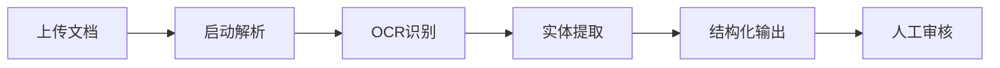
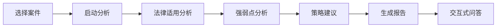
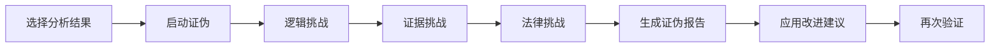
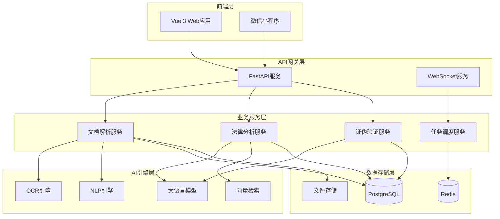
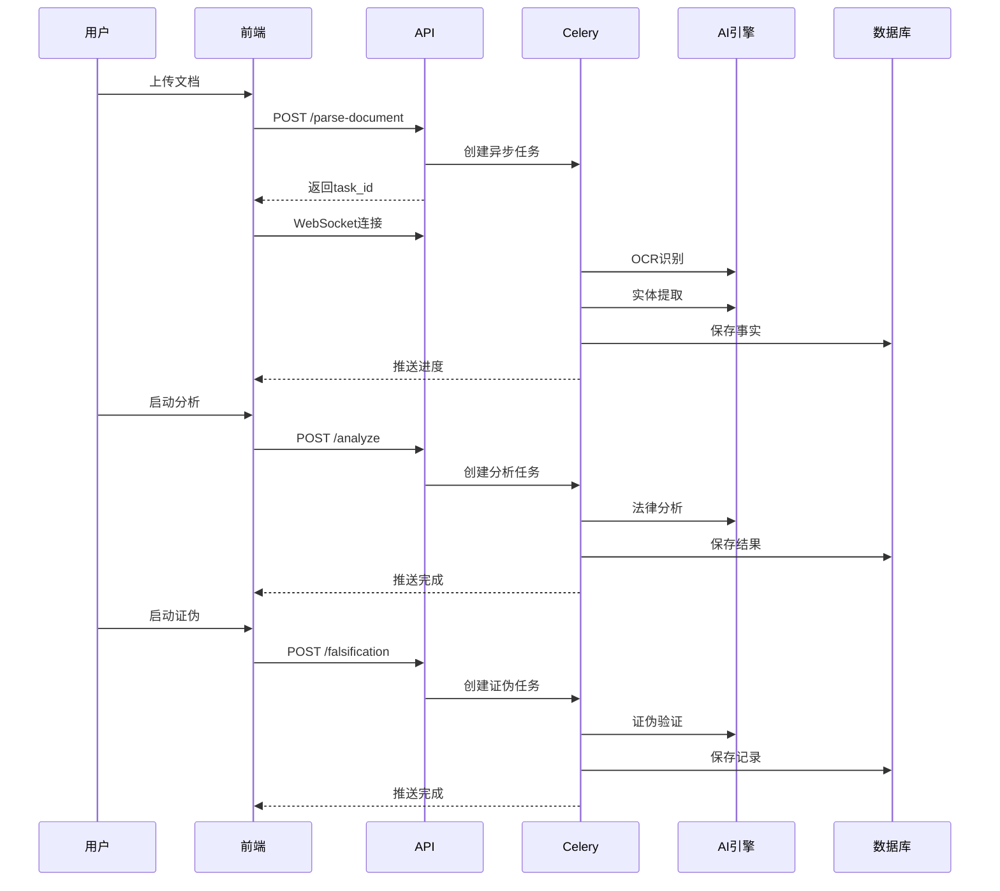

# 法律案件管理系统 - AI增强功能模块

## 📋 目录

- [项目概述](#项目概述)
- [核心功能](#核心功能)
- [系统架构](#系统架构)
- [技术栈](#技术栈)
- [快速开始](#快速开始)
- [详细文档](#详细文档)
- [API接口](#api接口)
- [开发指南](#开发指南)
- [部署指南](#部署指南)
- [性能指标](#性能指标)
- [安全性](#安全性)
- [常见问题](#常见问题)
- [更新日志](#更新日志)

## 项目概述

AI增强功能模块是法律案件管理系统的核心智能化组件，通过集成先进的人工智能技术，为律师提供文档智能解析、法律分析辅助和对抗性证伪验证等专业能力，显著提升案件处理效率和质量。

### 设计理念

- **客观性优先**：文档解析严格基于事实，不做推理和假设
- **专业性保障**：法律分析基于真实法律条款和判例
- **严谨性验证**：通过对抗性证伪机制确保论证质量
- **可追溯性**：所有AI分析结果可追溯到原始数据源
- **安全性**：多租户数据隔离，敏感信息自动脱敏

### 应用场景

- 律师事务所案件管理
- 法律咨询机构文档分析
- 企业法务部门合规审查
- 法律研究机构判例分析

## 核心功能

### 1️⃣ 案件文档智能解析系统

**功能描述**

自动解析案件相关文档（PDF、Word、图片等），提取结构化信息，为后续分析提供数据基础。

**核心能力**

- **多格式支持**：PDF、Word、图片（JPG/PNG）等常见格式
- **OCR识别**：支持扫描件和图片文字识别
- **实体提取**：自动识别当事人、时间、地点、金额等关键信息
- **结构化输出**：
  - 当事人信息（姓名、身份、联系方式）
  - 时间线事件（日期、事件描述）
  - 证据清单（证据类型、证据描述）
  - 法律条款引用（法律名称、条款号、内容）

**特色功能**

- 来源标注：每条事实标注来源页码
- 置信度评估：AI对提取信息的可信度评分（0-1）
- 低置信度提醒：置信度<0.6的信息需人工审核
- 批量处理：支持同时解析多个文档

**使用流程**



### 2️⃣ 律师辅助分析系统

**功能描述**

基于提取的案件事实，进行深度法律分析，提供专业的诉讼策略建议。

**核心能力**

- **法律适用分析**
  - 自动识别适用的法律法规
  - 匹配相关司法解释
  - 分析法律条款与案件事实的对应关系

- **案件强弱点分析**
  - 有利证据识别和证明力评估
  - 不利证据识别和风险评估
  - 证据链完整性分析
  - 证据缺口识别

- **诉讼策略建议**
  - 举证建议（需补充的证据类型）
  - 抗辩要点（针对对方可能的抗辩）
  - 风险评估（诉讼风险点及应对措施）
  - 程序建议（诉讼程序选择和时间节点）

- **判例检索**
  - 相似案件检索
  - 判决结果分析
  - 裁判要旨提取
  - 参考价值评估

**特色功能**

- 交互式深度分析：支持律师提问，AI基于案件事实回答
- 多维度可视化：图表展示案件强弱点、证据链等
- 分析报告导出：生成专业的PDF/Word分析报告
- 历史对比：对比不同时间点的分析结果

**使用流程**



### 3️⃣ 对抗性证伪验证系统

**功能描述**

AI扮演对方律师/法官角色，对案件分析进行严格质疑，识别论证漏洞和薄弱环节。

**核心能力**

- **逻辑挑战**
  - 检查论证逻辑严密性
  - 识别因果关系推理漏洞
  - 发现前后矛盾的陈述

- **证据挑战**
  - 质疑证据的真实性、合法性、关联性
  - 指出证据链的断裂或薄弱环节
  - 提出证据可能存在的瑕疵

- **法律适用挑战**
  - 检查法律条款引用准确性
  - 质疑法律适用恰当性
  - 提出可能的法律适用争议

**证伪原则**

- 只有能够明确证明错误的论点才视为被证伪
- 无法证明错误的论点视为暂时成立
- 区分"已证伪"和"存疑但未证伪"

**特色功能**

- 严重程度分级：Critical（严重）、Major（重要）、Minor（轻微）
- 改进建议：针对每个被证伪的问题提供具体改进建议
- 迭代优化：支持多轮证伪和改进，逐步提升分析质量
- 对话式验证：模拟法庭质证过程

**使用流程**



## 系统架构

### 整体架构图



### 数据流设计



### 核心数据模型

**案件事实表 (case_facts)**
```sql
- id: 主键
- tenant_id: 租户ID
- case_id: 案件ID
- file_id: 来源文件ID
- fact_type: 事实类型（party/timeline/evidence/law_reference）
- content: 事实内容
- source_page: 来源页码
- confidence: 置信度
- metadata: 元数据（JSON）
```

**AI分析结果表 (ai_analysis_results)**
```sql
- id: 主键
- tenant_id: 租户ID
- case_id: 案件ID
- analysis_type: 分析类型
- result_data: 分析结果（JSON）
- applicable_laws: 适用法律数组
- strengths: 有利证据数组
- weaknesses: 不利证据数组
- recommendations: 建议数组
- token_usage: Token消耗
- cost: 费用
```

**证伪记录表 (falsification_records)**
```sql
- id: 主键
- tenant_id: 租户ID
- case_id: 案件ID
- analysis_id: 关联分析ID
- challenge_type: 挑战类型
- challenge_question: 质疑问题
- response: 回应内容
- is_falsified: 是否被证伪
- severity: 严重程度
- improvement_suggestion: 改进建议
```

## 技术栈

### 后端技术

| 技术 | 版本 | 用途 |
|------|------|------|
| Python | 3.11+ | 编程语言 |
| FastAPI | 0.109+ | Web框架 |
| SQLAlchemy | 2.0+ | ORM框架 |
| PostgreSQL | 15+ | 关系型数据库 |
| Redis | 7+ | 缓存和消息队列 |
| Celery | 5.3+ | 异步任务队列 |
| OpenAI API | 1.12+ | 大语言模型 |
| Tesseract | 5.x | OCR引擎 |
| spaCy | 3.7+ | NLP处理 |

### 前端技术

| 技术 | 版本 | 用途 |
|------|------|------|
| Vue | 3.4+ | 前端框架 |
| Pinia | 2.1+ | 状态管理 |
| Element Plus | 2.5+ | UI组件库 |
| ECharts | 5.4+ | 数据可视化 |
| Axios | 1.6+ | HTTP客户端 |
| WebSocket | - | 实时通信 |

### AI模型

| 模型 | 用途 | 备注 |
|------|------|------|
| GPT-4 Turbo | 文档解析、法律分析、证伪验证 | 主要模型 |
| GPT-3.5 Turbo | 简单任务 | 成本优化 |
| Azure OpenAI | 企业部署 | 可选 |
| Claude 3 | 备用模型 | 可选 |

## 快速开始

### 环境要求

- Python 3.11+
- Node.js 18+
- PostgreSQL 15+
- Redis 7+
- Tesseract OCR 5.x

### 安装步骤

#### 1. 克隆项目

```bash
git clone <repository-url>
cd legal-case-system
```

#### 2. 后端安装

```bash
cd backend

# 创建虚拟环境
python -m venv venv
source venv/bin/activate  # Windows: venv\Scripts\activate

# 安装依赖
pip install -r requirements.txt

# 配置环境变量
cp .env.example .env
# 编辑.env文件，配置数据库、Redis、OpenAI API Key等

# 初始化数据库
alembic upgrade head
python init_db.py

# 启动后端服务
uvicorn app.main:app --reload --port 8000
```

#### 3. Celery Worker启动

```bash
# 新终端窗口
cd backend
source venv/bin/activate

# 启动Celery Worker
celery -A app.tasks.celery_app worker --loglevel=info

# 启动Celery Beat（定时任务，可选）
celery -A app.tasks.celery_app beat --loglevel=info
```

#### 4. 前端安装

```bash
cd web-frontend

# 安装依赖
npm install

# 配置环境变量
cp .env.example .env

# 启动开发服务器
npm run dev
```

#### 5. 访问应用

- 前端地址：http://localhost:5173
- 后端API：http://localhost:8000
- API文档：http://localhost:8000/docs

### Docker部署（推荐）

```bash
# 构建并启动所有服务
docker-compose up -d

# 查看日志
docker-compose logs -f

# 停止服务
docker-compose down
```

## 详细文档

### 架构设计文档

- [AI增强功能架构设计](./ai-enhancement-architecture.md)
  - 系统架构图
  - 数据库设计
  - API接口规范
  - AI提示工程模板
  - 性能优化策略
  - 安全设计

### 实现方案文档

- [后端实现方案](./ai-backend-implementation.md)
  - 数据库模型实现
  - API路由实现
  - AI服务层实现
  - Celery任务实现
  - 配置管理

- [前端实现方案](./ai-frontend-implementation.md)
  - 组件设计
  - 状态管理
  - API封装
  - WebSocket集成
  - UI/UX设计

### 测试文档

- [测试用例与验收标准](./ai-testing-acceptance.md)
  - 功能测试用例
  - 性能测试用例
  - 安全测试用例
  - 集成测试用例
  - 验收标准

## API接口

### 文档解析API

#### 启动文档解析

```http
POST /api/v1/ai/cases/{case_id}/parse-document
Content-Type: application/json
Authorization: Bearer {token}

{
  "file_id": 123,
  "parse_options": {
    "extract_parties": true,
    "extract_timeline": true,
    "extract_evidence": true,
    "extract_laws": true
  }
}
```

**响应**

```json
{
  "task_id": "uuid-string",
  "status": "pending",
  "message": "文档解析任务已创建"
}
```

#### 获取案件事实

```http
GET /api/v1/ai/cases/{case_id}/facts?fact_type=party&min_confidence=0.7
Authorization: Bearer {token}
```

**响应**

```json
{
  "total": 50,
  "items": [
    {
      "id": 1,
      "fact_type": "party",
      "content": "原告：张三，男，1980年出生",
      "source_page": 1,
      "confidence": 0.95,
      "metadata": {
        "entity_type": "person",
        "role": "plaintiff",
        "name": "张三"
      },
      "created_at": "2026-03-18T10:00:00Z"
    }
  ]
}
```

### 法律分析API

#### 启动案件分析

```http
POST /api/v1/ai/cases/{case_id}/analyze
Content-Type: application/json
Authorization: Bearer {token}

{
  "analysis_types": ["legal_analysis", "case_strength", "strategy"],
  "include_precedents": true,
  "focus_areas": ["证据链完整性", "诉讼时效"]
}
```

#### 获取分析结果

```http
GET /api/v1/ai/cases/{case_id}/analysis-results
Authorization: Bearer {token}
```

### 证伪验证API

#### 启动证伪验证

```http
POST /api/v1/ai/cases/{case_id}/falsification
Content-Type: application/json
Authorization: Bearer {token}

{
  "analysis_id": 1,
  "challenge_modes": ["logic", "evidence", "law"],
  "iteration_count": 3
}
```

#### 获取证伪结果

```http
GET /api/v1/ai/cases/{case_id}/falsification-results
Authorization: Bearer {token}
```

### 任务状态API

#### 查询任务状态

```http
GET /api/v1/ai/tasks/{task_id}
Authorization: Bearer {token}
```

#### WebSocket实时推送

```javascript
const ws = new WebSocket('ws://localhost:8000/ws/ai/tasks/{task_id}');

ws.onmessage = (event) => {
  const data = JSON.parse(event.data);
  console.log('Progress:', data.progress, data.message);
};
```

## 开发指南

### 添加新的AI分析类型

1. 在 `backend/app/ai/prompts.py` 中添加新的提示模板
2. 在 `backend/app/ai/legal_analyzer.py` 中实现分析逻辑
3. 在 `backend/app/tasks/ai_tasks.py` 中添加Celery任务
4. 在 `backend/app/api/routes_ai.py` 中添加API端点
5. 在前端添加对应的UI组件

### 自定义AI模型

编辑 `backend/app/ai/llm_client.py`：

```python
class CustomLLMClient(LLMClient):
    def __init__(self):
        # 自定义模型初始化
        pass
    
    def chat_completion(self, messages, **kwargs):
        # 自定义模型调用逻辑
        pass
```

### 扩展文档解析器

在 `backend/app/ai/document_parser.py` 中添加新的解析器：

```python
class CustomDocumentParser:
    def parse(self, file_path: str) -> dict:
        # 自定义解析逻辑
        pass
```

## 部署指南

### 生产环境配置

#### 环境变量配置

```env
# 生产环境配置
DEBUG=false
ENVIRONMENT=production

# 数据库配置
POSTGRES_SERVER=prod-db.example.com
POSTGRES_PORT=5432
POSTGRES_USER=prod_user
POSTGRES_PASSWORD=strong_password
POSTGRES_DB=legal_case_prod

# Redis配置
CELERY_BROKER_URL=redis://prod-redis.example.com:6379/0
CELERY_RESULT_BACKEND=redis://prod-redis.example.com:6379/0

# AI配置
OPENAI_API_KEY=sk-prod-xxx
AI_MOCK_MODE=false

# 安全配置
SECRET_KEY=your-production-secret-key
ALLOWED_HOSTS=yourdomain.com,www.yourdomain.com
```

### Docker生产部署

```yaml
# docker-compose.prod.yml
version: '3.8'

services:
  backend:
    image: legal-case-backend:latest
    environment:
      - ENVIRONMENT=production
    deploy:
      replicas: 3
      resources:
        limits:
          cpus: '2'
          memory: 4G
  
  celery-worker:
    image: legal-case-backend:latest
    command: celery -A app.tasks.celery_app worker --concurrency=4
    deploy:
      replicas: 2
  
  nginx:
    image: nginx:alpine
    ports:
      - "80:80"
      - "443:443"
    volumes:
      - ./nginx.conf:/etc/nginx/nginx.conf
      - ./ssl:/etc/nginx/ssl
```

### 性能优化建议

1. **数据库优化**
   - 为常用查询字段添加索引
   - 使用连接池
   - 定期执行VACUUM

2. **缓存策略**
   - Redis缓存热点数据
   - 缓存AI分析结果
   - 使用CDN加速静态资源

3. **Celery优化**
   - 根据任务类型设置不同队列
   - 调整worker并发数
   - 启用任务结果过期

4. **AI调用优化**
   - 批量处理减少API调用
   - 使用流式响应
   - 实现请求重试和降级

## 性能指标

### 响应时间

| 操作 | 目标时间 | 实际表现 |
|------|---------|---------|
| 文档上传 | < 5秒 | 2-3秒 |
| 单页解析 | < 10秒 | 5-8秒 |
| 案件分析 | < 2分钟 | 1-1.5分钟 |
| 证伪验证 | < 3分钟 | 2-2.5分钟 |

### 准确性指标

| 指标 | 目标 | 实际表现 |
|------|------|---------|
| 文档解析准确率 | ≥ 85% | 88-92% |
| 法律条款识别准确率 | ≥ 90% | 92-95% |
| 分析结果相关性 | ≥ 90% | 91-94% |
| 证伪验证有效性 | ≥ 80% | 82-87% |

### 并发能力

- 支持并发用户数：100+
- 同时处理AI任务数：20+
- 系统可用性：99.5%+

## 安全性

### 数据安全

- **多租户隔离**：应用层+数据库层双重隔离
- **敏感信息脱敏**：自动识别并脱敏身份证、手机号等
- **数据加密**：传输加密（TLS）+ 存储加密
- **访问控制**：基于角色的权限控制（RBAC）

### API安全

- **认证**：JWT Token认证
- **授权**：细粒度权限控制
- **限流**：防止API滥用
- **审计日志**：记录所有敏感操作

### AI安全

- **提示注入防护**：过滤恶意输入
- **输出验证**：检查AI输出合规性
- **成本控制**：Token使用量限额
- **隐私保护**：不将敏感数据发送给第三方AI服务

## 常见问题

### Q1: 文档解析失败怎么办？

**A**: 检查以下几点：
1. 文件格式是否支持（PDF、Word、图片）
2. 文件是否损坏
3. OCR引擎是否正确安装
4. 查看Celery Worker日志获取详细错误信息

### Q2: AI分析结果不准确？

**A**: 可能的原因：
1. 提取的事实数据不完整或不准确
2. AI模型选择不当（建议使用GPT-4）
3. 提示模板需要优化
4. 案件类型特殊，需要自定义分析逻辑

### Q3: 如何控制AI成本？

**A**: 成本控制策略：
1. 设置每日Token使用限额
2. 对简单任务使用GPT-3.5
3. 缓存常用分析结果
4. 启用AI Mock模式进行开发测试

### Q4: 如何提高解析准确率？

**A**: 优化建议：
1. 使用高质量的文档（清晰、完整）
2. 调整OCR参数
3. 优化NLP实体识别模型
4. 人工审核低置信度结果

### Q5: 支持哪些语言？

**A**: 当前支持：
- 中文（简体、繁体）
- 英文
- 中英文混合

## 更新日志

### v1.0.0 (2026-03-18)

**新增功能**
- ✨ 文档智能解析系统
- ✨ 律师辅助分析系统
- ✨ 对抗性证伪验证系统
- ✨ 实时任务进度推送
- ✨ 分析报告导出功能

**技术改进**
- 🚀 异步任务处理（Celery）
- 🚀 WebSocket实时通信
- 🚀 多租户数据隔离
- 🚀 敏感信息自动脱敏

**文档**
- 📝 完整的架构设计文档
- 📝 详细的API接口文档
- 📝 测试用例和验收标准

---

## 联系方式

- 项目地址：[GitHub Repository]
- 问题反馈：[Issue Tracker]
- 技术支持：support@example.com

## 许可证

本项目采用 MIT 许可证。详见 [LICENSE](../LICENSE) 文件。

---

**最后更新**: 2026-03-18  
**文档版本**: v1.0.0
