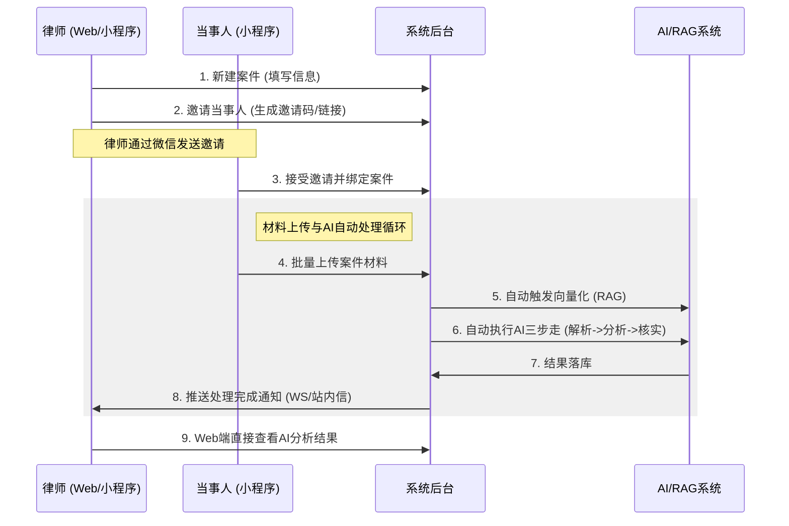

# 法律案件AI助手 - 系统架构与业务流程 (v4)

## 1. 项目愿景
本项目旨在为律师提供一个高效的案件管理与AI辅助分析平台。律师只需管理案件和查看结果，繁琐的材料解析、事实提取和证据核实由AI自动完成。

## 2. 核心业务流程

## 3. 关键逻辑说明

### 3.1 律师端 (Web/小程序)
- **管理导向**：律师负责创建案件、维护基本信息、管理当事人。
- **结果导向**：Web端主要用于展示AI分析后的结构化数据（事实清单、法律分析、证据核实结果），律师无需手动点击“开始分析”。
- **邀请机制**：律师新建案件后，系统生成邀请凭证，预留微信邀请入口。

### 3.2 当事人端 (小程序)
- **便捷上传**：当事人通过微信小程序进入案件，支持图片、文档的批量上传。
- **增量上传**：支持多次上传。每次批量上传完成后，系统都会自动触发新一轮的AI分析，确保结果是最新的。

### 3.3 AI 自动化流水线
- **上传即触发**：系统监听文件上传完成事件。
- **流水线作业**：
    1. **向量化**：文件进入RAG系统进行切片和向量化。
    2. **AI解析**：提取文件中的关键事实。
    3. **AI分析**：基于提取的事实进行法律风险分析。
    4. **AI核实**：对事实进行交叉验证和证伪。
- **异步处理**：所有AI操作均为异步执行，通过WebSocket实时推送进度。

## 4. 接口架构调整

### 4.1 文件上传接口 (改造)
- `POST /api/v1/files/upload`
- **新增逻辑**：支持标记“批量上传结束”。当收到结束信号或上传完成后，后台自动启动AI流水线。

### 4.2 AI 任务接口 (简化)
- 律师不再需要调用 `POST /api/v1/ai/cases/{id}/analyze` 等触发类接口。
- 接口保留用于系统内部调用或手动重试。

---
*本文档为系统核心逻辑的真源，所有开发工作应以此流程为准。*
