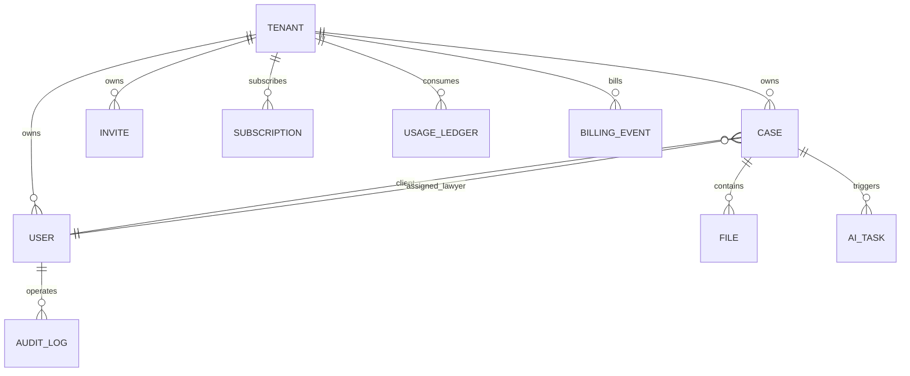
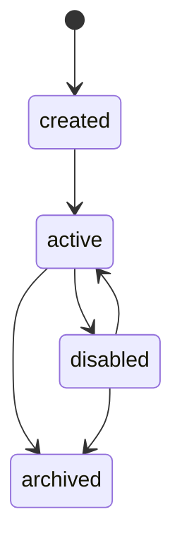
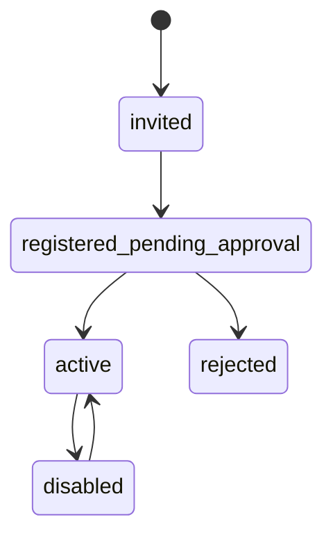
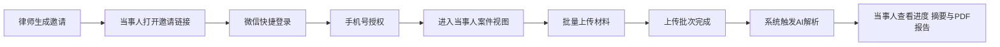
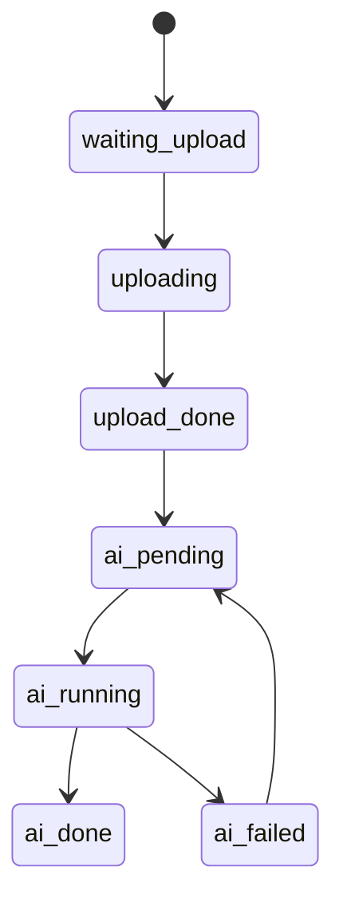
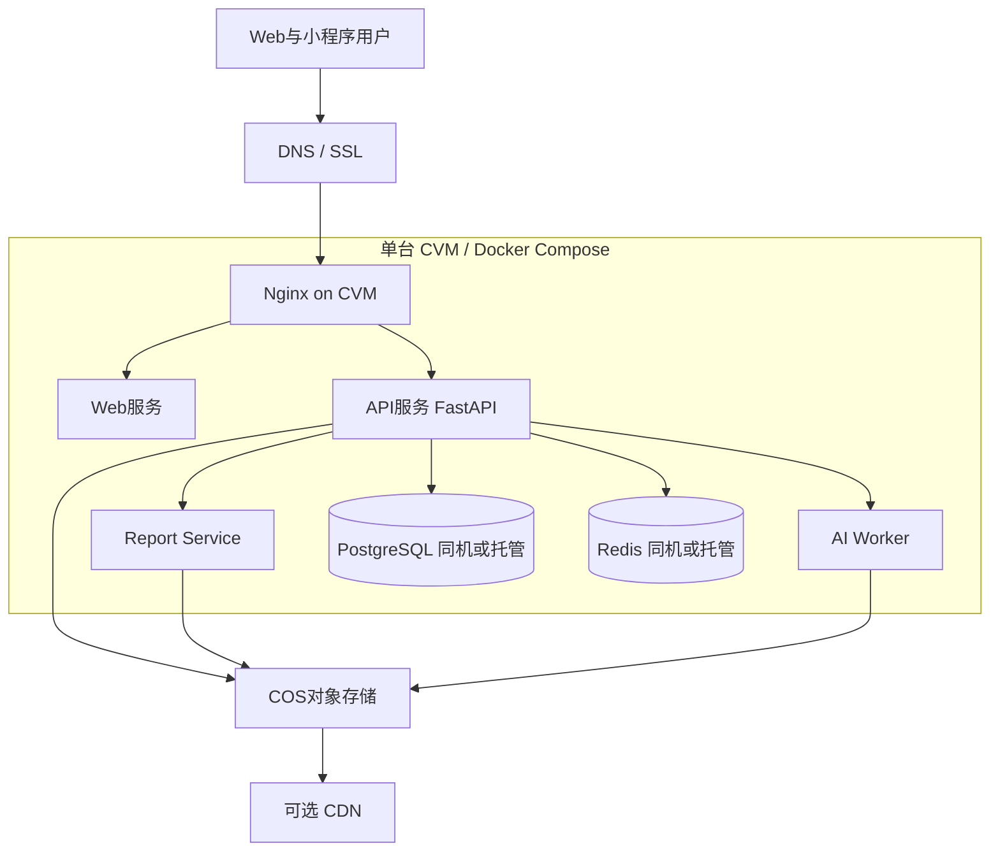
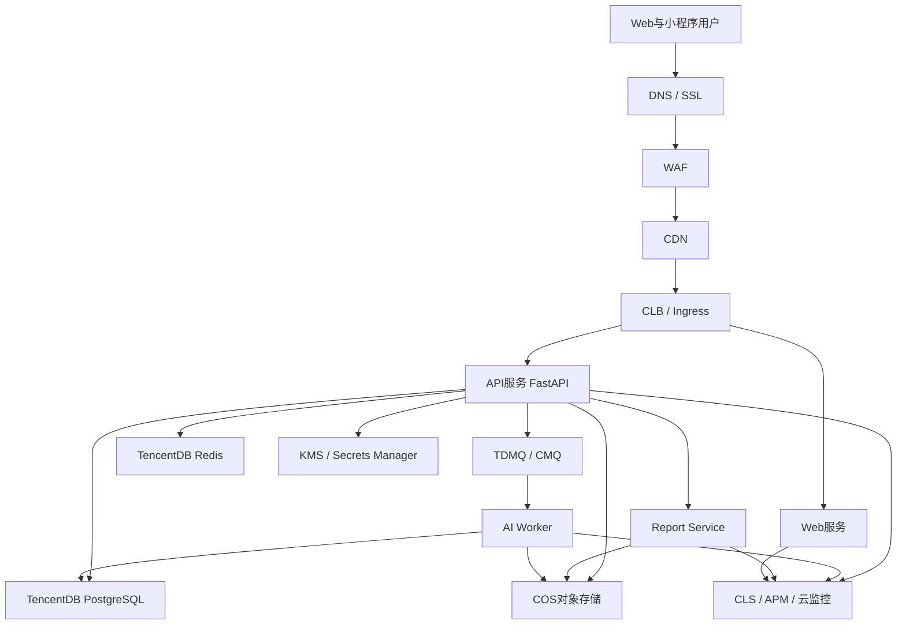

# 法律案件系统整体框架设计落地文档

> 文档版本：V2.2
> 文档类型：可执行架构方案
> 适用范围：Web 管理端 + 微信小程序端 + 腾讯云部署 + 多租户收费演进
> 约束：本文件仅定义架构与方案，不包含代码改动

---

## 0. 目标与设计原则

### 0.1 目标
在现有系统基础上，形成可直接指导开发实施的统一框架，覆盖以下能力：
1. 五类角色完整权限模型
2. 租户与组织全生命周期治理
3. 双通道认证与微信绑定
4. Web 双导航体系
5. 五大核心页面交互规范
6. 小程序当事人闭环
7. 腾讯云生产级部署拓扑
8. 多租户收费演进路径
9. P0 P1 P2 分阶段落地与验收

### 0.2 设计原则
- 单一接口真源：双端共享 `/api/v1`
- 角色权限后端强约束，前端仅做体验守卫
- 所有关键动作可审计，具备 request_id 追踪
- 所有跨端流程定义状态机与幂等语义
- 生产服务启动、发布、存储与回滚全部在云端完成，不依赖开发机、办公室网络或住宅网络
- 先可用后增强：P0 业务闭环优先，P1 可运维，P2 可商业化

---

## 1. 领域模型与角色权限矩阵

## 1.1 领域边界
- 认证域：账号、微信登录、扫码登录、会话吊销、兼容短信能力
- 组织域：租户、成员、邀请、审批、禁用
- 案件域：案件、当事人、律师分配、状态流转
- 文件域：上传策略、文件归档、访问令牌
- AI 域：解析、分析、证伪、任务与结果
- 运维域：审计、监控、告警、密钥
- 商业化域：套餐、配额、用量、计费事件、欠费策略

## 1.2 核心实体模型

## 1.3 实体字段建议

### TENANT
- `id` `tenant_code` `name` `type`
- `status`：`active disabled archived`
- `billing_status`：`normal warned restricted suspended`
- `created_at` `updated_at`

### USER
- `id` `tenant_id` `phone` `real_name`
- `role`：`super_admin tenant_admin org_lawyer solo_lawyer client`
- `status`：`pending_approval active disabled rejected`
- `wechat_openid` `last_login_at`

### CASE
- `id` `tenant_id` `case_number` `title`
- `client_id` `assigned_lawyer_id`
- `status`：`new in_progress awaiting_client under_review completed archived cancelled`
- `deadline_at` `warning_level` `created_by`

### AI_TASK
- `id` `tenant_id` `case_id` `task_type`
- `status`：`pending queued running success failed timeout cancelled`
- `idempotency_key` `trigger_source` `started_at` `ended_at`

### BILLING_EVENT
- `id` `tenant_id` `event_type` `resource_type`
- `resource_id` `quantity` `unit_price` `amount`
- `occurred_at` `trace_id`

## 1.4 角色权限矩阵

> 标记：✅允许、◐条件允许、❌禁止

| 功能域 | 独立律师 | 机构律师 | 机构管理员 | 超级管理员 | 当事人 |
|---|---:|---:|---:|---:|---:|
| 手机号注册登录 | ✅ | ✅ | ✅ | ✅ | ✅ |
| 微信绑定登录 | ✅ | ✅ | ✅ | ✅ | ✅ |
| 创建租户 | personal ✅ | ❌ | organization ✅ | ✅ | ❌ |
| 加入机构 | ❌ | ✅ | ❌ | ✅ | ❌ |
| 邀请律师 | ❌ | ❌ | ✅ | ✅ | ❌ |
| 审批机构律师 | ❌ | ❌ | ✅ | ✅ | ❌ |
| 禁用成员 | ❌ | ❌ | ✅ | ✅ | ❌ |
| 创建案件 | ✅ | ✅ | ✅ | ✅ | ❌ |
| 查看案件 | 本人相关 ✅ | 本机构授权 ✅ | 本机构全量 ✅ | 全局监管 ✅ | 本人案件 ✅ |
| 修改案件状态 | 本人负责 ✅ | 本人负责 ✅ | 本机构 ✅ | ✅ | ❌ |
| 上传材料 | ✅ | ✅ | ✅ | ✅ | 本人案件 ✅ |
| 手动触发 AI | ✅ | ✅ | ✅ | ✅ | ❌ |
| 查看 AI 结果 | ✅ | ✅ | ✅ | ✅ | 摘要与进度 ◐ |
| AI 配置与提示词 | ❌ | ❌ | ✅ | ✅ | ❌ |
| 套餐与账单管理 | ✅ 仅 personal | ❌ | ✅ 本机构 | ✅ 全局 | ❌ |
| 审计日志查看 | 本人关联 ◐ | 本机构关联 ◐ | 本机构全量 ✅ | 全局 ✅ | 本人摘要 ◐ |

## 1.5 数据权限矩阵

| 数据对象 | 独立律师 | 机构律师 | 机构管理员 | 超级管理员 | 当事人 |
|---|---|---|---|---|---|
| tenant | personal | 当前机构 | 当前机构 | 全部租户 | 当前租户只读 |
| users | 自己 | 本机构律师只读 | 本机构可管理 | 全部可管理 | 自己 |
| cases | 本人关联 | 本机构授权 | 本机构全量 | 全部 | 本人 |
| files | 本人关联 | 本机构授权 | 本机构全量 | 全部 | 本人案件 |
| ai_tasks | 本人案件 | 本机构授权 | 本机构全量 | 全部 | 仅进度摘要 |
| billing | 当前租户 | 无 | 当前机构 | 全部 | 无 |

---

## 2. 租户与组织模型

## 2.1 生命周期

## 2.2 成员邀请审批状态机

## 2.3 关键流程
1. 创建租户
   - 个人租户：`POST /api/v1/tenants/personal`
   - 机构租户：`POST /api/v1/tenants/organization`
2. 邀请成员
   - 律师邀请：`POST /api/v1/users/invite-lawyer`
3. 注册入驻
   - 邀请注册：`POST /api/v1/auth/invite-register`
4. 审批与禁用
   - 审批：`PATCH /api/v1/users/{id}/approve`
   - 禁用：`PATCH /api/v1/users/{id}/status`
5. 审计追踪
   - 每一步写入审计日志：动作、操作者、租户、目标对象、前后状态

## 2.4 审计字段建议
- `audit_id`
- `tenant_id`
- `operator_user_id`
- `action`：`tenant_create invite_send member_approve member_disable`
- `resource_type` `resource_id`
- `before_snapshot` `after_snapshot`
- `request_id` `ip` `user_agent` `occurred_at`

---

## 3. 认证方案

## 3.1 登录与注册方式

### 方式 A 手机号验证码注册登录
- 发送验证码：`POST /api/v1/auth/sms/send`
- 校验验证码：`POST /api/v1/auth/sms/verify`
- 注册时携带 `phone_verification_token`：`POST /api/v1/auth/register`
- Web 短信验证码登录：`POST /api/v1/auth/sms-login`

### 方式 B 手机号加密码登录
- 注册：`POST /api/v1/auth/register`
- 登录：`POST /api/v1/auth/login`

### 方式 C 微信直登 / 绑定 / Web 扫码
- Web 扫码建票：`POST /api/v1/auth/web-wechat-login`
- Web 扫码状态：`GET /api/v1/auth/web-wechat-login/{ticket}`
- 小程序确认扫码：`POST /api/v1/auth/web-wechat-login/{ticket}/confirm`
- 浏览器兑换登录态：`POST /api/v1/auth/web-wechat-login/{ticket}/exchange`
- 小程序 code 登录：`POST /api/v1/auth/wx-mini-login`
- 微信手机号授权绑定：`POST /api/v1/auth/wx-mini-phone-login`
- 兼容旧版显式绑定：`POST /api/v1/auth/wx-mini-bind-existing`
- 旧接口兼容：`POST /api/v1/auth/wx-mini-bind`
- 退出登录撤销会话：`POST /api/v1/auth/logout`

## 3.2 输入格式约束

| 字段 | 约束 | 规则 |
|---|---|---|
| phone | 必填 | `^1[3-9]\d{9}$` |
| password | 必填 场景化 | 长度 10 到 128，包含大小写字母 数字 特殊字符，禁止空格 |
| sms_code | 必填 | `^\d{6}$`，有效期 5 分钟，单次使用 |
| tenant_code | 选填 | 小写字母数字中划线，长度 3 到 50 |
| wechat_openid | 微信流程必填 | 长度 6 到 100 |

## 3.3 鉴权与会话建议
- Access Token：15 分钟
- Refresh Token：7 天
- 绑定租户 claim：`tenant_id role is_tenant_admin`
- 高风险动作二次校验：审批 禁用 密钥变更

## 3.4 错误码建议
- `AUTH_REQUIRED` 未登录或令牌失效
- `FORBIDDEN` 权限不足
- `VALIDATION_ERROR` 参数不合法
- `USER_NOT_ACTIVE` 用户待审批或禁用
- `TENANT_NOT_FOUND` 租户不存在或不可用

---

## 4. Web 信息架构与导航差异

## 4.1 全局 IA
- 顶栏：租户切换 消息 用户菜单
- 左侧导航：按角色动态渲染
- 主区：列表页 详情页 抽屉与弹窗统一交互规范

## 4.2 机构管理员导航 4 菜单
1. 概览
2. 案件管理
3. 当事人管理
4. 律师管理

## 4.3 独立律师导航 3 菜单
1. 概览
2. 案件管理
3. 当事人管理

> 差异点：独立律师无 `律师管理` 与 `分析管理` 菜单

## 4.4 路由与权限守卫建议
- 路由元信息：`required_roles` `tenant_scope` `feature_flag`
- 后端返回 403 时前端统一转无权限页
- mini-only 接口在 Web 路由层禁止入口

---

## 5. 核心页面交互规范

## 5.1 概览动态页
### 页面目标
提供当前角色最关键工作面板：待处理、预警、动态、AI 运行态。

### 交互规范
- 首屏卡片：案件总数 待审批律师 待处理 AI 任务 预警案件
- 动态流：按时间倒序展示事件
- 点击卡片进入对应过滤列表

### 状态机
`idle -> loading -> success`
`loading -> empty`
`loading -> error -> retry -> loading`

## 5.2 案件管理页
### 页面目标
支持案件创建、筛选、状态流转、截止预警。

### 关键交互
- 列表字段：案号 标题 当事人 负责人 状态 截止时间 更新时间
- 筛选：状态 法律类型 关键词 时间区间
- 行操作：查看详情 更新状态 调整截止 指派律师
- 预警规则：剩余 7 天红色，剩余 30 天黄色，`completed` 不预警

### 状态机
`draft -> saved`
`saved -> updating`
`updating -> success`
`updating -> conflict`

## 5.3 当事人管理页
### 页面目标
聚合当事人资料与关联案件，支持回跳联动。

### 关键交互
- 列表：姓名 手机号 案件数 最后上传时间
- 详情：基本信息 关联案件 上传记录
- 从当事人详情跳案件详情并可回退

## 5.4 律师管理页
### 页面目标
完成机构律师邀请 审批 启停。

### 关键交互
- 邀请按钮生成注册链接
- 待审批列表支持批量审批
- 状态切换支持禁用与恢复

### 状态机
`invited -> pending_approval -> active`
`pending_approval -> rejected`
`active -> disabled -> active`

## 5.5 AI 深度分析与证伪入口
### 当前策略
- 当前正式入口仅保留 `AI 解析`
- `法律分析`、`证伪`、`分析管理` 从 Web / 小程序正式导航中隐藏
- 已有后端接口与后台配置代码继续保留，待下一阶段重新开放并联调

---

## 6. 小程序当事人闭环

## 6.1 端到端流程

## 6.2 闭环接口建议
1. 邀请入口
   - `GET /api/v1/cases/{case_id}/invite-qrcode`
2. 登录绑定
   - `POST /api/v1/auth/wx-mini-login`
   - `POST /api/v1/auth/wx-mini-phone-login`
   - `POST /api/v1/auth/wx-mini-bind-existing`
   - `POST /api/v1/auth/logout`
3. 上传链路
   - `GET /api/v1/files/upload-policy`
   - `POST /api/v1/files/upload`
   - 建议新增 `POST /api/v1/files/batches/complete`
4. AI 触发与查询
   - 前台正式入口仅保留 `parse`
   - `法律分析 / 证伪` 继续保留后端能力，但当前版本不向正式用户入口开放
   - `GET /api/v1/ai/tasks/{task_id}` 查询进度

## 6.3 当事人可见范围
- 可见：本人案件基础信息、文件上传进度、AI 摘要
- 不可见：机构内部律师数据、敏感推理过程、其他当事人数据

## 6.4 上传到 AI 的状态机

---

## 7. 腾讯云部署拓扑

## 7.1 当前推荐商用拓扑：`CVM + COS`

## 7.2 扩容演进拓扑：`CLB + 多 CVM` 或 `TCR + TKE`

## 7.3 组件职责
- 当前首阶段运行面：`CVM + Docker Compose`，负责快速上线 Web、API、AI Worker、Report Service。
- 公网接入层：首阶段使用域名、TLS、Nginx；下载量和跨地域访问增长后再补 `CDN`、`WAF`、`CLB`。
- API 服务：业务逻辑、权限校验、审计写入、上传授权、下载授权。
- 对象存储：证据文件、报告文件、导出文件的唯一生产持久化存储。
- 数据库：首阶段可同机部署，随后按稳定性与租户数演进到托管数据库。
- 缓存：首阶段可同机部署，随后演进到托管 Redis。
- 队列与任务：首阶段允许 `DB Queue` 兼容，增长阶段切换到 `TDMQ/CMQ`。
- 密钥管理：首阶段完成主机环境变量收口与最小权限；增长阶段进入 `KMS / Secrets Manager`。
- 监控告警：日志、指标、链路、事件与容量告警。

## 7.4 网络与云端启动原则
- 生产服务必须在腾讯云 `VPC` 内启动和运行，不依赖本地电脑、办公室宽带或家宽公网 IP。
- 当前首阶段允许以 `单台 CVM` 作为运行面，但禁止继续依赖本地文件目录作为生产真源。
- 文件上传与下载必须优先走 `COS + 签名策略`；热点下载与跨地域访问再补 `CDN`。
- 所有对外访问统一收敛到云端域名，不允许“直连某台主机端口”作为长期入口。
- 首阶段发布可通过 `Docker Compose` 在 `CVM` 完成；后续演进到镜像仓库与云端工作负载。

## 7.5 生产落地约束
- 公网仅暴露 `80/443`，`22` 仅对运维白名单开放。
- `PostgreSQL` `Redis` `Queue` 默认不对公网开放。
- 生产文件真源固定为 `COS`，不以本地卷作为长期生产存储。
- 首阶段可接受单机运行，但必须具备快照、备份、迁移脚本和重建手册。
- 架构必须保留向 `CLB + 多 CVM` 或 `TCR + TKE` 演进的边界，不得把文件、队列和配置重新绑死在单机本地。
- 审计日志与访问日志保存策略分级。

## 7.6 迁移波次
- Wave 1：订阅 `CVM`、`COS`、域名、`SSL`，完成单台云主机首阶段上线。
- Wave 2：证据文件与报告文件切换到 `COS`，前端改为直传/签名下载。
- Wave 3：按需要接入 `CDN`、托管 `PostgreSQL/Redis`、第二台 `CVM`、`CLB`。
- Wave 4：当租户数和异步任务量继续增长时，切换到 `TDMQ/CMQ` 与容器化运行面。

## 7.7 监控告警基线
- API 错误率 5 分钟窗口超过 2 触发告警。
- 非 AI 接口 P95 超过 800ms 持续告警。
- AI 任务失败率 15 分钟窗口超过 10 告警。
- `CVM` CPU、内存、磁盘、出网流量超过阈值时触发告警。
- COS 上传/下载失败率异常时触发告警。
- `CLB/Ingress` 仅在进入多实例阶段后纳入健康检查告警。

---

## 8. 多租户收费演进方案

## 8.1 套餐模型

### Plan
- `plan_code` `plan_name`
- `monthly_price`
- `user_limit` `storage_limit_gb` `ai_quota_monthly`
- `overage_price_token` `overage_price_storage`

### Subscription
- `tenant_id` `plan_code`
- `status`：`trial active expired suspended`
- `start_at` `end_at` `auto_renew`

## 8.2 配额与用量统计
- 统计维度：租户 日 周 月 资源类型
- 资源类型：用户数 存储 AI 请求 token
- 数据来源：业务事件 + AI 任务结果 + 文件元数据

## 8.3 计费事件模型

| 事件 | 触发时机 | 计费字段 |
|---|---|---|
| `ai_task_succeeded` | AI 成功结束 | task_type token_in token_out cost |
| `file_storage_changed` | 文件新增删除 | storage_delta_gb |
| `user_seat_changed` | 成员启停变化 | seat_delta |
| `plan_upgraded` | 套餐升级 | old_plan new_plan prorated_amount |

## 8.4 欠费策略

### 状态机
`normal -> warned -> restricted -> suspended -> recovered`

### 策略说明
- `warned`：站内通知 + 短信提醒
- `restricted`：禁止新建案件与手动触发 AI，保留查看下载
- `suspended`：登录后仅可访问续费与账单页面
- `recovered`：支付成功后恢复业务能力

## 8.5 对现有系统的演进兼容
- 保留当前 `tenant.subscription_expire_at` 与 `balance` 字段
- 逐步新增 `plans subscriptions usage_ledger billing_events invoices`
- 先做月度汇总账单，再扩展实时预扣

---

## 9. 分阶段实施路线与验收标准

## 9.1 P0 业务闭环与权限基线
### 目标
双端跑通，五角色权限可验证，案件到 AI 闭环可用。

### 范围
- 角色模型与权限矩阵落地
- 租户创建 邀请 审批 禁用闭环
- Web IA 双导航落地
- 小程序当事人邀请到查看结果闭环
- 审计日志关键动作覆盖

### 验收标准
- 权限越权测试通过率 100
- 邀请审批主流程全通过
- 上传后自动触发 AI 成功率达到门槛
- 关键动作均可按 request_id 检索

## 9.2 P1 云上可运维与稳定性
### 目标
以 `CVM + COS` 为首阶段生产基线，确保服务与存储均在云端，具备可执行的上线、备份、恢复与后续扩容前提；当租户数和流量增长后，再演进到 `CLB + 多 CVM` 或 `TCR/TKE`。

### 范围
- 单台或双台 `CVM` 云端运行
- 网关 `TLS + 域名 + Nginx`，按流量与访问范围补 `CDN/WAF/CLB`
- `COS` 直传、签名下载与报告存储
- 同机或托管 `PostgreSQL/Redis`
- `DB Queue` 或 `TDMQ/CMQ` 的云端 worker 常驻异步化
- 监控告警、快照备份与恢复手册
- 为后续多实例与托管化保留演进边界

### 验收标准
- 开发机、办公室网络或家宽断开不会影响线上服务运行。
- 文件上传下载已不依赖本地卷与主机直链。
- 关键告警可触发、可恢复，且有 `CVM` 快照与数据库备份策略。
- AI 任务链路可观测且可重试。
- 单台 `CVM` 故障时不要求自动无损切换，但必须可按 runbook 在新实例恢复。
- 后续升级到多 `CVM`、托管数据面或容器化时，无需回退文件存储模式。

## 9.3 P2 商业化与多租户收费
### 目标
支持套餐、配额、用量、账单、欠费治理。

### 范围
- 套餐与订阅管理
- 用量统计台账
- 计费事件与月账单
- 欠费策略执行

### 验收标准
- 不同套餐配额限制可生效
- 计费事件与账单可对账
- 欠费状态切换与能力收敛符合策略

---

## 10. 主任务需求覆盖映射

| 主任务要求 | 本文覆盖章节 | 覆盖结论 |
|---|---|---|
| 领域模型与角色权限矩阵 | 第 1 章 | 完整覆盖 |
| 租户与组织模型 | 第 2 章 | 完整覆盖 |
| 认证方案 | 第 3 章 | 完整覆盖 |
| Web IA 与导航差异 | 第 4 章 | 完整覆盖 |
| 核心页面交互规范 | 第 5 章 | 完整覆盖 |
| 小程序当事人闭环 | 第 6 章 | 完整覆盖 |
| 腾讯云部署拓扑 | 第 7 章 | 完整覆盖 |
| 多租户收费演进 | 第 8 章 | 完整覆盖 |
| 分阶段路线与验收 | 第 9 章 | 完整覆盖 |

---

## 11. 与当前仓库基线的衔接说明

### 已有能力可复用
- 租户创建与加入流程基础接口已存在
- 微信登录绑定基础接口已存在
- 案件 文件 AI 核心接口已存在
- 小程序来源校验与部分角色约束已存在

### 需按本方案增强的重点
- 显式引入 `solo_lawyer` 与 `super_admin` 角色语义
- 将页面守卫能力下沉为后端强约束
- 增加上传批次完成事件触发 AI 编排
- 增加套餐 配额 计费 账单领域模型与策略执行

---

## 12. 当前实现状态（2026-03）

### 12.1 P0 已落地能力（以仓库现状为准）

1. 认证与注册主链路
   - 已落地微信小程序直登、Web 微信扫码登录、Web 短信验证码登录、手机号密码登录、refresh session 吊销。
   - Web 端现支持三类正式登录：账号密码、短信验证码、微信扫码。
2. 邀请与审批闭环
   - 已落地律师邀请链接生成、待审批列表、审批通过与状态切换。
   - 机构律师邀请改为微信登录直入待审批链路。
3. super admin 最小能力
   - 已落地后端全租户与全用户只读管理接口。
4. Web 管理端 P0
   - 已落地账号密码、短信验证码、微信扫码三类登录入口与角色化菜单路由守卫。
   - 已落地角色化菜单与路由守卫。
   - 已落地当事人受限页、待审批页、访问受限页。
   - 已落地“概览”“案件管理”“当事人管理”“律师管理”正式入口。
   - `法律分析 / 证伪 / 分析管理` 当前从正式入口隐藏。
5. 小程序 P0
   - 已落地当事人邀请直达微信登录。
   - 已落地当事人案件资料上传闭环（上传策略、上传、列表刷新、预览下载）。
   - 已落地 AI 任务状态展示（WS + 轮询补偿）。
   - 已落地角色分流与端来源头收敛：当事人进入案件视图，独户律师进入案件台，机构律师进入机构概览。

### 12.2 P0 边界说明（当前版本不应误判为已完成）

1. Web 的当事人管理当前为轻量工作台能力，不是完整业务中台。
2. 概览页当前为基础统计，不包含增量运营卡片。
3. 案件管理当前缺少高级排序与自动案号生成。
4. 法律分析 / 证伪 / 分析管理当前已从正式入口隐藏，重新开放前仍需补可视化和发布链路。
5. 收费域仍处于方案层，尚未形成数据模型与业务闭环。

### 12.3 P1 待办（下一阶段功能增强）

1. 概览增量卡片
   - 新增 AI 处理中任务数、近 7 天新增案件、近 7 天上传量、异常任务数。
   - 卡片支持跳转到带过滤条件的列表页。
2. 案件高级排序与自动案号
   - 后端增加排序字段白名单与排序方向参数。
   - 增加自动案号规则与唯一性约束。
   - Web 增加排序控件并保存用户排序偏好。
3. AI 深度分析与证伪重新开放
   - 重新设计法律分析 / 证伪页面的用户入口与权限边界。
   - 增加模型参数、提示词配置读取与编辑发布能力。

### 12.4 P2 待办（商业化与治理）

1. 收费闭环
   - 落地套餐、订阅、配额、用量、账单、欠费策略执行。
2. 多租户成本治理
   - 落地 AI 与存储用量台账，支持对账与异常告警。
3. 运营与审计增强
   - 对关键动作提供更完整审计检索与导出。

### 12.5 与验收文档的衔接

- 需求项逐条状态、证据与下一步建议以 `docs/final-acceptance-checklist.md` 为准。
- 本章节用于表达阶段边界与路线，不替代逐条验收清单。

---

## 13. 交付说明
本文件作为后续代码改造唯一框架输入，开发与测试需按本文件章节逐项对照实现与验收。
