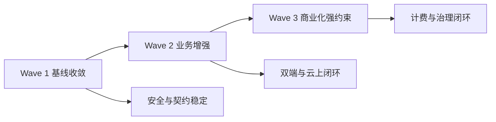

# 腾讯云多租户计费统一执行蓝图

> 文档类型：整合执行蓝图
> 适用范围：现状缺口审阅、Web 认证权限拆分、Web 业务模块拆分、小程序拆分、云部署与计费拆分的统一落地
> 生效原则：以本文件口径为准，后续任务拆分与委派均需引用本文件任务编号

---

## 0. 变更说明与口径统一

### 0.1 本次重写范围

本文件已从“框架方案”重写为“可直接执行蓝图”，重点补齐以下能力：

1. 新增审阅结论总览，明确需求覆盖、当前能力、关键缺口与冲突口径。
2. 新增统一任务命名规范与验收模板，供后续 agent 批量复用。
3. 新增 `WF-AUTH-*`、`WF-WEB-*`、`WF-MINI-*`、`WF-CLOUD-*`、`WF-BILL-*` 一体化任务清单。
4. 新增 Wave 1/2/3 执行分波与跨波次依赖关系。
5. 新增风险与缓解策略，覆盖权限越权、计量幂等、队列重复消费等关键风险。
6. 新增“云上托管后停用 AI 手工配置编辑”落地方案，包含技术开关与管理开关。
7. 新增按模式的 Agent 执行建议，支持后续按任务类型直接委派。

### 0.2 重复与冲突统一结果

| 冲突项 | 原有冲突现象 | 统一口径 | 执行约束 |
|---|---|---|---|
| `solo_lawyer` 角色语义 | 现状多处按 `lawyer + personal tenant` 近似承载 | Wave 1 保持兼容映射，Wave 2 补后端显式语义与校验 | 任何权限改动必须先保留兼容路径 |
| WS 路径口径 | 文档存在 `/ws/ai/tasks/{task_id}` 与 `/api/v1/ws/ai/tasks/{task_id}` 混用 | 对外接入统一为 `/ws/ai/tasks/{task_id}`，鉴权口径与 REST 一致 | 网关层与端侧文档必须同口径 |
| AI 执行模式 | 已有同步执行与队列化目标并存 | 通过 `AI_EXECUTION_MODE=sync|queue` 控制，默认 `sync`，达标后切换 `queue` | 禁止无开关直接切换 |
| Web 对 mini-only 接口调用 | 业务上不应调用，但现状存在误用风险 | mini-only 接口由后端强约束，Web 端同步清理入口 | 前后端双重收敛，不依赖单侧守卫 |
| 云上暴露面 | 方案层与执行层描述粒度不一致 | 生产公网最小暴露仅 `80/443` 与可选 `22` 白名单 | 发布门禁必须包含端口检查 |

---

## 1. 审阅结论

### 1.1 需求覆盖结论

| 审阅来源 | 覆盖结论 | 当前判定 |
|---|---|---|
| 现状缺口审阅 | 1 到 9 项框架需求中，核心链路可用但治理能力不足 | 部分实现为主，计费域缺失最明显 |
| Web 认证权限拆分 | 角色基线与租户隔离已有基础，仍有前端守卫依赖与 `solo_lawyer` 语义缺口 | 需先补后端强约束 |
| Web 业务模块拆分 | 菜单、概览、案件、分析页具备骨架，接口契约与可用性需收敛 | 需按模块逐项对齐 |
| 小程序拆分 | 上传与 AI 主链路可通，编码规范、封装一致性、自动编排需增强 | 需补模板规范与接口一致性 |
| 云部署与计费拆分 | 部署基线具备，云上可运维与计费策略尚未形成闭环 | 需分波推进，先观测后约束 |

### 1.2 当前能力基线

1. 后端已有 `/api/v1` 统一接口主干、JWT 鉴权、租户上下文注入。
2. Web 与小程序双端已接入主要业务链路。
3. 多租户基础字段与部分 RLS 实践已存在。
4. 生产部署已有 Nginx + Compose 基础模板。
5. AI 能力已有任务模型、轮询链路与部分 WS 能力。

### 1.3 关键缺口

1. 认证权限：WS 鉴权、跨租户白名单机制、`solo_lawyer` 显式语义未完全固化。
2. Web 业务：API 调用口径存在漂移，页面层直调接口导致维护成本高。
3. 小程序：AI 页面编码与模板稳定性存在风险，双端封装与错误码映射未完全统一。
4. 云部署：生产网络暴露、密钥托管、日志审计、队列化运行标准缺乏统一执行门禁。
5. 计费治理：套餐、配额、计量、账单、欠费状态机尚未形成可执行闭环。

### 1.4 冲突口径执行规则

1. 涉及角色与权限的改动，后端强约束优先于前端守卫。
2. 涉及双端接口的改动，API 契约文档为单一真源。
3. 涉及执行模型切换的改动，必须通过特性开关灰度。
4. 涉及计费限制的改动，必须先完成“告警模式”再进入“拦截模式”。

---

## 2. 统一任务命名规范与验收模板

### 2.1 命名规范

- 任务 ID 统一格式：`WF-<DOMAIN>-<NN>-<ACTION>`
- `DOMAIN` 取值：`AUTH` `WEB` `MINI` `CLOUD` `BILL`
- `NN` 为两位流水号，从 `01` 开始。
- `ACTION` 使用短动宾短语，建议全大写中划线。

示例：

- `WF-AUTH-01-WS-AUTH-AND-TENANT-CHECK`
- `WF-WEB-03-ROLE-MENU-ROUTER-ALIGN`
- `WF-BILL-04-SOFT-LIMIT-FILES-AI`

### 2.2 状态与产出规范

- 状态：`TODO` `DOING` `BLOCKED` `DONE`
- 每个任务必须有：输入依赖、变更边界、验证清单、回滚点、证据链接。

### 2.3 单任务验收模板

| 字段 | 模板要求 |
|---|---|
| 任务 ID | `WF-XXX-XX-XXXX` |
| 任务目标 | 单一可验证目标，不混多个大项 |
| 输入依赖 | 前置任务 ID 与契约文档版本 |
| 修改范围 | 文件或模块边界，禁止越界 |
| 实施步骤 | 3 到 8 条原子步骤 |
| 验证项 | 接口、页面、权限、日志至少覆盖两类 |
| 回滚策略 | 明确回滚开关与回退路径 |
| 完成证据 | 测试结果、日志片段、截图或报告链接 |

### 2.4 跨任务验收模板

| 关卡 | 通过标准 |
|---|---|
| 契约一致性 | Web 与小程序同接口路径、参数、错误码一致 |
| 权限安全性 | 越权用例无放行，跨租户访问被拒绝 |
| 运行稳定性 | 关键路径无阻塞回归，异常可回滚 |
| 可运维性 | request_id、审计日志、告警链路可追踪 |

---

## 3. 总体任务清单

> 说明：以下任务为统一蓝图主干，均可独立委派执行。

### 3.1 `WF-AUTH-*` 认证与权限任务

| 任务 ID | 目标 | 验收要点 |
|---|---|---|
| `WF-AUTH-01-WS-AUTH-AND-TENANT-CHECK` | 为 AI WS 接口补齐 JWT 与租户归属校验 | 无 token 4401，越权 4403，跨租户不可读 |
| `WF-AUTH-02-AI-IDEMPOTENCY-CONTRACT` | AI 发起接口统一 `Idempotency-Key` 语义 | 同 key 同 payload 复用，同 key 异 payload 409 |
| `WF-AUTH-03-SOLO-LAWYER-SEMANTIC-HARDEN` | 固化 `solo_lawyer` 语义与可见范围 | personal 场景数据边界稳定，无误放行 |
| `WF-AUTH-04-CLIENT-MINI-ONLY-POLICY` | 收敛 client 的 mini-only 后端策略 | Web 误调被拒绝，mini 正常通过 |
| `WF-AUTH-05-CROSS-TENANT-WHITELIST-AUDIT` | 建立跨租户白名单与审计机制 | 仅白名单接口允许跨租户，均有审计证据 |

### 3.2 `WF-WEB-*` Web 业务任务

| 任务 ID | 目标 | 验收要点 |
|---|---|---|
| `WF-WEB-01-API-CONTRACT-ALIGN` | 修复关键页面 API 路径与 method 漂移 | 不再出现契约性 404 405 |
| `WF-WEB-02-API-CLIENT-SINGLE-ENTRY` | 建立 API 单出口，收敛页面直调 | 视图层不再新增 URL 拼接 |
| `WF-WEB-03-ROLE-MENU-ROUTER-ALIGN` | 菜单矩阵与路由守卫对齐后端权限 | admin 与 lawyer 菜单差异稳定 |
| `WF-WEB-04-OVERVIEW-DYNAMIC-METRICS` | 概览页动态指标落地 | 指标字段完整，空态异常态可用 |
| `WF-WEB-05-CASES-FILTER-SORT-WARNING` | 案件列表筛选排序预警能力补齐 | 筛选分页排序行为稳定 |
| `WF-WEB-06-ANALYSIS-MANAGE-BASELINE` | 分析管理页从骨架升级为基础可用 | 看板可读，入口联动可用 |
| `WF-WEB-07-MINI-ONLY-ENTRY-CLEANUP` | 清理 Web 对 mini-only 的误调用入口 | 前端不再触发非预期 403 |
| `WF-WEB-08-INTEGRATION-REGRESSION-GATE` | 固化 Web 集成回归门禁 | 关键路径回归清单可重复执行 |

### 3.3 `WF-MINI-*` 小程序任务

| 任务 ID | 目标 | 验收要点 |
|---|---|---|
| `WF-MINI-01-AI-PAGE-ENCODING-TEMPLATE-FIX` | 修复 AI 三页面编码与模板稳定性 | 无乱码、可编译、可交互 |
| `WF-MINI-02-API-WRAPPER-ALIGN-WITH-WEB` | 小程序 API 封装与 Web 对齐 | 同接口双端行为一致 |
| `WF-MINI-03-HEADER-TOKEN-IDEMPOTENCY-INJECT` | 统一 headers token 幂等键注入 | 联调时请求上下文完整 |
| `WF-MINI-04-UPLOAD-BATCH-COMPLETE-TRIGGER` | 补齐上传批次完成到 AI 触发链路 | 上传完成后触发编排稳定 |
| `WF-MINI-05-ROLE-REGRESSION-MATRIX` | 建立小程序角色回归矩阵 | client 与 lawyer 边界清晰 |

### 3.4 `WF-CLOUD-*` 云部署任务

| 任务 ID | 目标 | 验收要点 |
|---|---|---|
| `WF-CLOUD-01-PROD-PORT-BASELINE` | 生产公网暴露收敛到 80 443 | 公网不可直连 DB Redis backend |
| `WF-CLOUD-02-TLS-AND-SECRET-MANAGEMENT` | TLS 与密钥托管标准化 | 证书密钥不入仓，轮换可执行 |
| `WF-CLOUD-03-OBSERVABILITY-REQUEST-TRACE` | 日志指标追踪统一到 request_id | 可按 request_id 追链路 |
| `WF-CLOUD-04-AI-WORKER-DEPLOY-SWITCH` | 队列 worker 部署与模式开关落地 | `sync|queue` 切换可控 |
| `WF-CLOUD-05-NETWORK-RUNBOOK-AND-ROLLBACK` | 网络发布检查与回滚流程标准化 | 发布回滚步骤可直接执行 |

### 3.5 `WF-BILL-*` 计费任务

| 任务 ID | 目标 | 验收要点 |
|---|---|---|
| `WF-BILL-01-BILLING-DOMAIN-SCHEMA` | 套餐配额计量账单表模型与约束 | 新增表含 `tenant_id` 与必要索引 |
| `WF-BILL-02-USAGE-IDEMPOTENCY-RECONCILE` | 计量流水幂等与日汇总对账机制 | 流水与汇总可对账 |
| `WF-BILL-03-PLAN-QUOTA-READ-APIS` | 套餐与配额只读接口上线 | 租户可查询当前套餐与用量 |
| `WF-BILL-04-SOFT-LIMIT-FILES-AI` | 文件上传与 AI 发起软约束 | 超配额告警并限制高成本增量 |
| `WF-BILL-05-INVOICE-OVERDUE-STATE-MACHINE` | 账单与欠费状态机落地 | warned restricted suspended 流转正确 |
| `WF-BILL-06-BILLING-AUDIT-AND-EXEMPTION` | 人工豁免与审计闭环 | 操作可追溯，豁免可撤销 |

---

## 4. 执行波次与跨波次依赖

### 4.1 Wave 分配

#### Wave 1 基线收敛

- `WF-AUTH-01` `WF-AUTH-02` `WF-AUTH-04` `WF-AUTH-05`
- `WF-WEB-01` `WF-WEB-02` `WF-WEB-03`
- `WF-MINI-01` `WF-MINI-02` `WF-MINI-03`
- `WF-CLOUD-01` `WF-CLOUD-02`

目标：先稳住契约、安全边界与基础可运维能力。

#### Wave 2 业务增强

- `WF-AUTH-03`
- `WF-WEB-04` `WF-WEB-05` `WF-WEB-06` `WF-WEB-07` `WF-WEB-08`
- `WF-MINI-04` `WF-MINI-05`
- `WF-CLOUD-03` `WF-CLOUD-04` `WF-CLOUD-05`
- `WF-BILL-01` `WF-BILL-02` `WF-BILL-03`

目标：形成双端业务闭环与云上运行闭环。

#### Wave 3 商业化与强约束

- `WF-BILL-04` `WF-BILL-05` `WF-BILL-06`

目标：完成计费策略执行与运营治理闭环。

### 4.2 跨波次依赖矩阵

| 后置任务 | 前置依赖 | 依赖原因 |
|---|---|---|
| `WF-WEB-04-OVERVIEW-DYNAMIC-METRICS` | `WF-WEB-01` `WF-WEB-02` | 指标接口与调用边界需先稳定 |
| `WF-WEB-06-ANALYSIS-MANAGE-BASELINE` | `WF-AUTH-01` `WF-AUTH-02` | 分析页依赖任务鉴权与幂等语义 |
| `WF-MINI-04-UPLOAD-BATCH-COMPLETE-TRIGGER` | `WF-MINI-02` `WF-AUTH-02` | 上传到 AI 触发依赖封装与幂等 |
| `WF-CLOUD-04-AI-WORKER-DEPLOY-SWITCH` | `WF-AUTH-01` `WF-AUTH-02` | 队列化前需先固化安全与幂等 |
| `WF-BILL-04-SOFT-LIMIT-FILES-AI` | `WF-BILL-01` `WF-BILL-02` `WF-BILL-03` | 先有计量与查询，再做限制 |
| `WF-BILL-05-INVOICE-OVERDUE-STATE-MACHINE` | `WF-BILL-04` | 欠费状态机依赖限制策略落地 |

### 4.3 波次流转图

---

## 5. 风险与缓解策略

| 风险项 | 触发场景 | 缓解策略 | 验收门禁 |
|---|---|---|---|
| 权限越权 | 路由守卫与后端鉴权不一致 | 后端强约束优先，补越权测试矩阵 | 越权用例必须全通过 |
| 计量幂等失效 | 重试或重复投递导致重复记账 | `Idempotency-Key` + 作用域唯一键 + 对账任务 | 计量与账单对账通过 |
| 队列重复消费 | worker 重启或消息重复投递 | 消费前终态检查，重复消息丢弃 | 同任务无重复写入 |
| 跨端契约漂移 | Web 与小程序各自解释字段 | API 契约单源 + 双端封装统一 | 双端同接口回归通过 |
| 云暴露面回退 | 发布时误开内部端口 | Compose 与安全组双重门禁 | 公网扫描仅见 80 443 |
| 配置漂移 | 手工改 AI 配置导致环境不一致 | 配置改动流水化 + 只读策略 | 未授权改动不可落库 |
| 误拦截业务 | 计费策略过早强拦截 | 先告警后软约束再强约束 | 分波门禁按策略执行 |

---

## 6. 云上托管后停用 AI 手工配置编辑方案

### 6.1 目标

云上托管完成后，AI 配置与提示词发布进入“平台托管模式”，禁止业务侧直接手工改写线上配置。

### 6.2 技术开关

1. 启用平台托管开关：`AI_CONFIG_MANAGED_MODE=true`。
2. 关闭手工编辑开关：`AI_MANUAL_CONFIG_EDIT_ENABLED=false`。
3. API 层拦截：对手工编辑入口统一返回受控错误码 `AI_CONFIG_MANUAL_EDIT_DISABLED`。
4. 前端 UI 收敛：配置页改为只读视图，仅展示当前发布版本与来源。
5. 发布路径统一：仅允许通过“配置版本发布流水”写入生效配置。
6. 紧急开关：保留 `AI_CONFIG_BREAK_GLASS_ENABLED`，默认关闭，仅超级管理员可短时开启。

### 6.3 管理开关

1. 角色收敛：常规租户管理员不再具备线上 AI 配置编辑权限。
2. 流程收敛：配置变更必须走变更单、双人复核与审计留痕。
3. 审计要求：记录操作者、审批人、变更前后版本、request_id、生效窗口。
4. 例外机制：紧急变更需事后补齐复盘与回收开关。

### 6.4 落地步骤

1. 盘点现网手工配置入口与调用来源。
2. 上线只读 UI 与 API 拦截，先灰度后全量。
3. 启用托管发布流水并验证回滚路径。
4. 关闭 `AI_CONFIG_BREAK_GLASS_ENABLED` 默认值并收口权限。
5. 将配置审计接入日常巡检与发布门禁。

### 6.5 验收标准

- 非授权角色无法编辑 AI 配置。
- 所有 AI 配置变更均可追溯到发布流水。
- 紧急开关开启与关闭均有审计记录。

---

## 7. Agent 执行建议

| 任务类型 | 推荐主模式 | 推荐协同模式 | 适用说明 |
|---|---|---|---|
| `WF-AUTH-*` | `architect` | `code` `debug` `review` | 先定权限边界与契约，再实现与越权回归 |
| `WF-WEB-*` | `architect` | `code` `review` | 先做接口与页面边界拆分，再执行页面级改造 |
| `WF-MINI-*` | `architect` | `code` `debug` | 先定义小程序状态机与封装边界，再联调排障 |
| `WF-CLOUD-*` | `architect` | `code` `debug` `review` | 先固化发布与回滚策略，再处理配置和环境验证 |
| `WF-BILL-*` | `architect` | `code` `debug` `review` | 先锁定计量账单模型，再逐步启用约束策略 |

### 7.1 模式切换建议

1. `architect`：输出任务边界、依赖、验收标准。
2. `code`：按单任务最小粒度实施改动。
3. `debug`：针对失败用例做根因定位与修复验证。
4. `review`：按任务 ID 做变更审查与回归签收。

---

## 8. 执行指引

1. 任何新子任务必须先映射到 `WF-*` 主任务编号。
2. 每次提交必须附带“任务 ID + 验收证据 + 回滚点”。
3. 跨波次任务禁止跳跃执行，除非完成风险评审并记录例外。
4. 若新增冲突口径，必须先更新本文件 `0.2` 再继续实施。

---

## 9. 结论

本文件已将现状缺口、Web 认证权限、Web 业务模块、小程序、云部署与计费五类拆分结果统一为可执行蓝图。后续执行以 `WF-*` 任务树、Wave 依赖矩阵、风险门禁与托管开关策略为唯一实施基线，可直接用于多 Agent 串行或并行委派。
